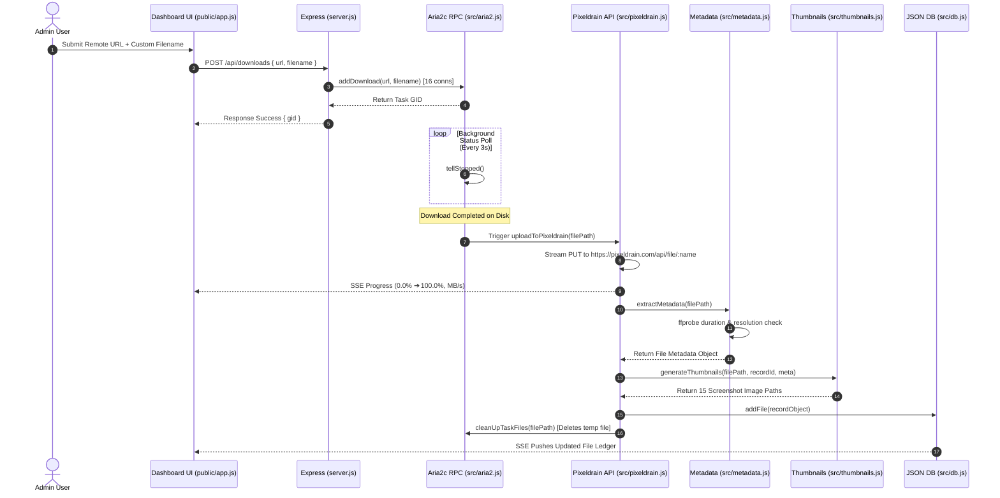
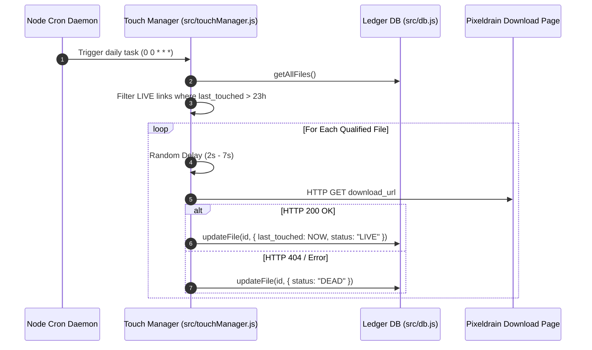

# 📘 PixelTouch Manager (`aria2c-pixeldrain`) — System Architecture & Knowledge Flow

This document provides a comprehensive technical reference for the **PixelTouch Manager** codebase. It outlines the core architecture, module design, execution flows, data pipelines, schema specifications, and security model.

---

## 1. Executive System Summary

**PixelTouch Manager** is a self-hosted, lightweight Node.js web application designed for high-speed remote downloading and automated cloud file retention. 

### Key Capabilities
* **16-Connection Enforcement:** Drives `aria2c` JSON-RPC daemon to maximize download bandwidth (`-x 16 -s 16`).
* **Live Streaming Uploads:** Streams completed downloads to **Pixeldrain** with real-time byte counters, speed indicators, and progress tracking via Server-Sent Events (SSE).
* **Deep Metadata & Frame Extraction:** Combines binary magic byte inspection with `ffprobe` to extract video durations, resolutions, and media signatures, generating a 15-frame screenshot gallery for video assets.
* **Automated Retention Daemon ("Touch Manager"):** Uses `node-cron` (`0 0 * * *`) and randomized rate-limited pings to reset cloud file inactivity expiration timers automatically.
* **Obsidian Flux Dark UI:** Responsive glassmorphism interface built with vanilla HTML/CSS/JS.

---

## 2. High-Level System Architecture

```mermaid
flowchart TD
    Client["💻 Admin User (Browser / Mobile)"]
    Express["🚀 Node.js Express Server (server.js)"]
    Auth["🔒 JWT & PIN Auth (src/auth.js)"]
    SSE["📡 SSE Real-Time Stream (/api/stream)"]
    Aria2Engine["⚡ Aria2c Daemon (JSON-RPC :6800)"]
    PixeldrainAPI["☁️ Pixeldrain Cloud API (PUT /api/file)"]
    MetadataEng["🔍 Metadata & FFprobe Engine (src/metadata.js)"]
    ThumbGen["🖼️ Screenshot Generator (src/thumbnails.js)"]
    CronDaemon["⏰ Touch Daemon Cron (src/touchManager.js)"]
    Database["💾 Flat-File JSON Ledger (data/files.json)"]

    Client -->|1. PIN Login / REST Requests| Express
    Express --> Auth
    Express -->|2. Event Push (1s)| SSE
    SSE --> Client
    Express -->|3. Add Download (-x16 -s16)| Aria2Engine
    Aria2Engine -->|4. Download Finished| Express
    Express -->|5. Stream File Upload| PixeldrainAPI
    Express -->|6. Inspect Duration & Specs| MetadataEng
    Express -->|7. Generate 15 Frames| ThumbGen
    Express -->|8. Record Meta & Links| Database
    CronDaemon -->|9. Daily Touch Ping| PixeldrainAPI
    CronDaemon -->|10. Update Link Status| Database
```

---

## 3. End-to-End Execution Flows

### 3.1 Download & Upload Pipeline



### 3.2 Daily Retention "Touch" Flow



---

## 4. Module & Directory Matrix

| File Path | Core Responsibility | Key Exported API |
| :--- | :--- | :--- |
| `server.js` | Express web server, REST API router, SSE streaming handler, static folder serving. | Entry Point (`node server.js`) |
| [src/aria2.js](file:///z:/P3/aria2c-gofile-rev-pixel/src/aria2.js) | Interfaces with `aria2c` JSON-RPC daemon. Spawns binary automatically, enforces 16 connections, polls task progress, cleans temp files. | `addDownload()`, `getDownloadsStatus()`, `checkConnection()`, `removeDownload()`, `startMonitor()` |
| [src/pixeldrain.js](file:///z:/P3/aria2c-gofile-rev-pixel/src/pixeldrain.js) | Handles Pixeldrain PUT file streaming uploads, reports real-time upload progress, extracts metadata/thumbnails, saves to DB. | `uploadToPixeldrain()` |
| [src/metadata.js](file:///z:/P3/aria2c-gofile-rev-pixel/src/metadata.js) | Inspects magic bytes (PNG, JPG, GIF, WEBP, MP4, WEBM) and executes `ffprobe` to determine width, height, resolution, and exact duration. | `extractMetadata()`, `formatBytes()`, `formatDuration()` |
| [src/thumbnails.js](file:///z:/P3/aria2c-gofile-rev-pixel/src/thumbnails.js) | Generates image thumbnails or extracts 15 evenly spaced video frame screenshots using `ffmpeg`. | `generateThumbnails()` |
| [src/touchManager.js](file:///z:/P3/aria2c-gofile-rev-pixel/src/touchManager.js) | Schedules daily `node-cron` daemon (`0 0 * * *`) and performs rate-limited pings on Pixeldrain links to prevent file expiration. | `touchFileRecord()`, `touchAllFiles()`, `initScheduler()` |
| [src/db.js](file:///z:/P3/aria2c-gofile-rev-pixel/src/db.js) | Thread/lock-safe JSON flat-file storage engine reading/writing to `data/files.json`. | `getAllFiles()`, `getFileById()`, `addFile()`, `updateFile()`, `deleteFile()` |
| [src/auth.js](file:///z:/P3/aria2c-gofile-rev-pixel/src/auth.js) | Authenticates PIN against `ADMIN_PIN` environment variable and handles HTTP-Only JWT session cookies. | `verifyPin()`, `generateToken()`, `verifyToken()`, `requireAuth` |
| [public/app.js](file:///z:/P3/aria2c-gofile-rev-pixel/public/app.js) | Frontend application logic: PIN auth keypad, SSE stream receiver, inline ledger editor, metadata modal, lightbox gallery. | Frontend App Controller |
| [public/style.css](file:///z:/P3/aria2c-gofile-rev-pixel/public/style.css) | Master stylesheet implementing the **Obsidian Flux** Glassmorphism design system. | Theme Tokens & UI Styles |

---

## 5. Ledger Data Schema (`data/files.json`)

All persistent metadata records are saved in `data/files.json`:

```json
[
  {
    "id": "gt_1784845422811_393",
    "filename": "video_sample.mp4",
    "custom_name": "My Custom Video Title",
    "original_filename": "video_sample.mp4",
    "source_url": "https://example.com/video_sample.mp4",
    "pixeldrain_id": "q6WKf7UM",
    "download_url": "https://pixeldrain.com/u/q6WKf7UM",
    "admin_code": "",
    "created_at": "2026-07-25T02:00:00.000Z",
    "last_touched": "2026-07-25T02:00:00.000Z",
    "status": "LIVE",
    "metadata": {
      "size_bytes": 5238714,
      "size_formatted": "5 MB",
      "category": "video",
      "extension": "mp4",
      "source_url": "https://example.com/video_sample.mp4",
      "resolution": "1920x1080",
      "width": 1920,
      "height": 1080,
      "duration_seconds": 10,
      "duration_formatted": "00:10"
    },
    "thumbnails": [
      "/data/image/gt_1784845422811_393-image-1.jpg",
      "/data/image/gt_1784845422811_393-image-2.jpg",
      "/data/image/gt_1784845422811_393-image-3.jpg"
    ]
  }
]
```

---

## 6. Environment Configuration (`.env`)

```env
PORT=6258
ADMIN_PIN=3331
PIXELDRAIN_API_TOKEN=your_pixeldrain_api_token
AUTO_START_ARIA2=true
ARIA2_PATH=C:\Program Portable\aria2c\aria2c.exe
ARIA2_RPC_URL=http://127.0.0.1:6800/jsonrpc
DATA_DIR=./data
```
